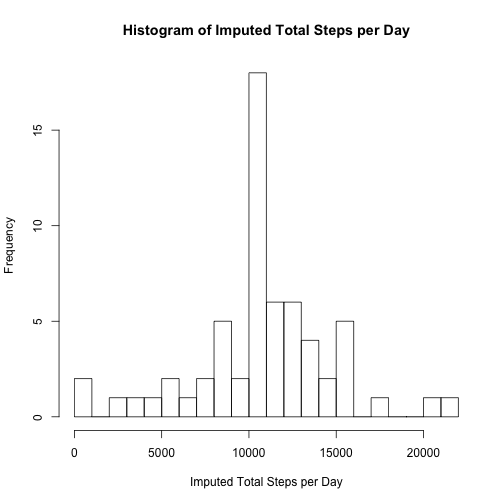

# Reproducible Research Week 2 Course Project 1

## 1. Code for reading in the dataset and/or processing the data


```r
library(knitr)
library(magrittr)
library(dplyr)
```

```
## 
## Attaching package: 'dplyr'
```

```
## The following objects are masked from 'package:stats':
## 
##     filter, lag
```

```
## The following objects are masked from 'package:base':
## 
##     intersect, setdiff, setequal, union
```

```r
library(ggplot2)

if (!file.exists("activity.csv")){
    download.file("https://d396qusza40orc.cloudfront.net/repdata%2Fdata%2Factivity.zip", destfile="activity.zip", mode="wb")
    unzip("activity.zip")
}
stepdata <- read.csv("activity.csv", header = TRUE)
```

## 2. Histogram of the total number of steps taken each day


```r
perdaysteps <- stepdata %>% select(date, steps) %>% group_by(date) %>% summarize(totalsteps = sum(steps, na.rm=TRUE))
hist(perdaysteps$totalsteps, xlab="Total Steps per Day",main="Histogram of Total Steps per Day", breaks=20)
```


## 3. Mean and median number of steps taken each day


```r
mm <- perdaysteps %>% summarise(Mean_ = mean(totalsteps, na.rm=TRUE), Median_=median(totalsteps, na.rm=TRUE))
mm
```

```
## # A tibble: 1 x 2
##   Mean_ Median_
##   <dbl>   <int>
## 1 9354.   10395
```

## 4. Time series plot of the average number of steps taken


```r
stepsbyinterval <- stepdata %>% select(interval, steps) %>% group_by(interval) %>% summarize(avgsteps = mean(steps, na.rm=TRUE)) 
qplot(interval, avgsteps, data=stepsbyinterval, geom="line", xlab = "5-minute interval", ylab = "Average number of steps taken (across all days)")
```


## 5. The 5-minute interval that, on average, contains the maximum number of steps


```r
max(stepsbyinterval$avgsteps)
```

```
## [1] 206.1698
```

```r
stepsbyinterval[which.max(stepsbyinterval$avgsteps),]
```

```
## # A tibble: 1 x 2
##   interval avgsteps
##      <int>    <dbl>
## 1      835     206.
```

The 5 minute interval at 835 contains, on average, the maximum number of steps

## 6. Code to describe and show a strategy for imputing missing data


```r
total_missing_values <- sum(is.na(stepdata$steps))
total_missing_values
```

```
## [1] 2304
```

The Strategy is to replace the missing value with the average for that 5 minute interval


```r
meanreplace <- function(x) replace(x, is.na(x), mean(x, na.rm = TRUE))
newstepdata <- stepdata %>% group_by(interval) %>% mutate(steps = meanreplace(steps)) %>% ungroup()
newperdaysteps <- newstepdata %>% select(date, steps) %>% group_by(date) %>% summarize(newtotalsteps = sum(steps, na.rm=TRUE))
```

## 7. Histogram of the total number of steps taken each day after missing values are imputed


```r
hist(newperdaysteps$newtotalsteps, xlab="Imputed Total Steps per Day", main="Histogram of Imputed Total Steps per Day", breaks=20)
```



```r
newmm <- newperdaysteps %>% summarise(Mean_ = mean(newtotalsteps, na.rm=TRUE), Median_=median(newtotalsteps, na.rm=TRUE))
newmm
```

```
## # A tibble: 1 x 2
##    Mean_ Median_
##    <dbl>   <dbl>
## 1 10766.  10766.
```

The new mean and median total number of steps per day both increased over the estimates from the first part of the assignment. Days where the total number of steps where zero went down significantly. While the number of days with the mean total number of steps went up.

## 8. Panel plot comparing the average number of steps taken per 5-minute interval across weekdays and weekends


```r
newstepdata$date <- as.Date(newstepdata$date)
newstepdata$weekday <- weekdays(newstepdata$date)
newstepdata$weekend <- ifelse(newstepdata$weekday=="Saturday" | newstepdata$weekday=="Sunday", "Weekend", "Weekday")
meansteps <- newstepdata %>% group_by(interval,weekend) %>% summarise(avgsteps = mean(steps))
qplot(interval,avgsteps,data=meansteps, geom="line", facets=weekend~., xlab="5-minute interval", ylab="Average number of steps", main="Average steps per interval across Weekday and Weekend")
```


